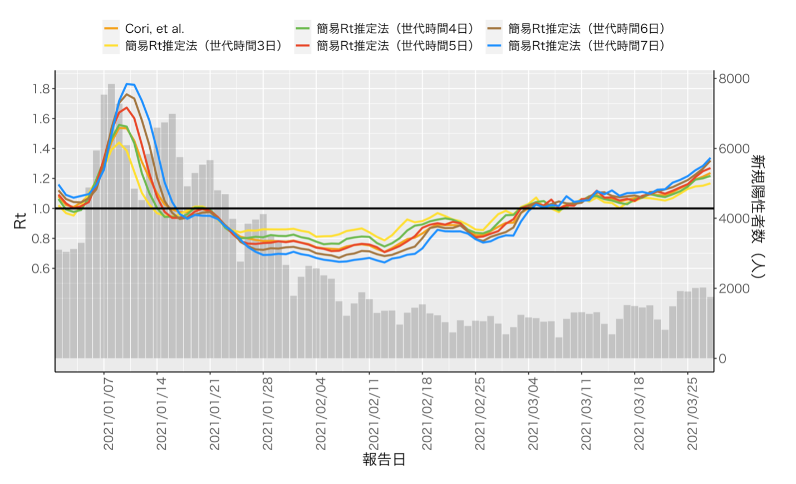

はじめに
実効再生産数（Effective reproduction number, 以下Rt）は「（ある時刻tにおける、一定の対策下での）１人の感染者による２次感染者数」と定義され1、現在流行が拡大期にあるのか収束に向かっているのかを評価する疫学指標の一つとして重要である。2019年末からの新型コロナウイルス感染症（COVID-19）の流行に際しては、世界各国・地域で流行状況を評価する指標として活用されている。しかし厳密なRtの計算には数学に関する知識やプログラミングの技術を必要とすることから、必ずしもそうした技能を有する人材がいるとは限らない現場での活用はすすんでいない。本稿では高度な専門知識を要さずに日ごとのCOVID-19陽性者数を使って簡便にRtの近似値を算出する方法を紹介し、その精度を検討した。

方法
Rtを推定する時の最も簡潔な考え方は、ある時刻における感染者数が全て世代時間（ある患者が感染してから2次感染を起こすまでの時間）前の感染者からうつされたとするものであり、この考え方を用いるとRtは「新規陽性者数／世代時間）日前の新規陽性者数」で近似することが出来る（補足資料）。実際にドイツのロベルト・コッホ研究所（Robert Koch Institut）では世代時間を4日に固定してこの方法でRtを計算し公表している2。Bonifazi, et alは週末の受診者数・検査数の減少といった新規感染者報告数の週内変動を考慮するために、7日間の移動平均を使うことを推奨しており、Rtを「直近7日間の新規陽性報告者数／（世代時間）日前7日間の新規陽性報告者数」で近似することを提案している3。以下この「直近7日間の新規陽性報告者数／（世代時間）日前7日間の新規陽性報告者数」を簡易Rt推定法と呼ぶ。
当解析では、厚生労働省が公開している日本の報告日別のCOVID-19感染者数のオープンデータ（https://www.mhlw.go.jp/stf/covid-19/open-data.html）を用いて、簡易Rt推定法で世代時間を3日、4日、5日、6日、7日と変更した時の2021年1月1日から3月28日までの日本のCOVID-19のRtを算出し、Cori, et alの4方法を用いた場合との比較を行った。Cori, et alの方法は世界的にも広く使われているものであり、発症間隔（serial interval）は過去の報告から平均4.8日、標準偏差2.3日と仮定した5。

結果
日本の2021年1月1日から3月28日までのCOVID-19流行曲線と、Cori, et alの方法、世代時間を3日〜7日とした場合の簡易Rt推定法で算出したRtを図1で示す。
世代時間を5日とした場合の簡易Rt推定法で算出したRtは、Cori, et alの方法によるRtに最も近いトレンドを示し、Rtの差の絶対値も最も小さかった（表1）。

