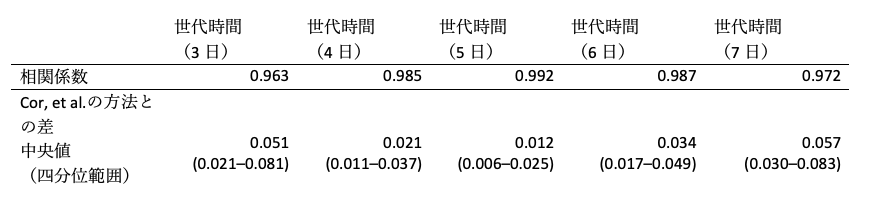

**はじめに**　　　　　　 

実効再生産数（Effective reproduction number, 以下Rt）は「（ある時刻tにおける、一定の対策下での）１人の感染者による２次感染者数」と定義され1、現在流行が拡大期にあるのか収束に向かっているのかを評価する疫学指標の一つとして重要である。2019年末からの新型コロナウイルス感染症（COVID-19）の流行に際しては、世界各国・地域で流行状況を評価する指標として活用されている。しかし厳密なRtの計算には数学に関する知識やプログラミングの技術を必要とすることから、必ずしもそうした技能を有する人材がいるとは限らない現場での活用はすすんでいない。本稿では高度な専門知識を要さずに日ごとのCOVID-19陽性者数を使って簡便にRtの近似値を算出する方法を紹介し、その精度を検討した。

**方法**    

Rtを推定する時の最も簡潔な考え方は、ある時刻における感染者数が全て世代時間（ある患者が感染してから2次感染を起こすまでの時間）前の感染者からうつされたとするものであり、この考え方を用いるとRtは「新規陽性者数／世代時間）日前の新規陽性者数」で近似することが出来る（補足資料）。実際にドイツのロベルト・コッホ研究所（Robert Koch Institut）では世代時間を4日に固定してこの方法でRtを計算し公表している2。Bonifazi, et alは週末の受診者数・検査数の減少といった新規感染者報告数の週内変動を考慮するために、7日間の移動平均を使うことを推奨しており、Rtを「直近7日間の新規陽性報告者数／（世代時間）日前7日間の新規陽性報告者数」で近似することを提案している3。以下この「直近7日間の新規陽性報告者数／（世代時間）日前7日間の新規陽性報告者数」を簡易Rt推定法と呼ぶ。
当解析では、厚生労働省が公開している日本の報告日別のCOVID-19感染者数のオープンデータ（https://www.mhlw.go.jp/stf/covid-19/open-data.html）　を用いて、簡易Rt推定法で世代時間を3日、4日、5日、6日、7日と変更した時の2021年1月1日から3月28日までの日本のCOVID-19のRtを算出し、Cori, et alの4方法を用いた場合との比較を行った。Cori, et alの方法は世界的にも広く使われているものであり、発症間隔（serial interval）は過去の報告から平均4.8日、標準偏差2.3日と仮定した5。

**結果**   

日本の2021年1月1日から3月28日までのCOVID-19流行曲線と、Cori, et alの方法、世代時間を3日〜7日とした場合の簡易Rt推定法で算出したRtを図1で示す。
世代時間を5日とした場合の簡易Rt推定法で算出したRtは、Cori, et alの方法によるRtに最も近いトレンドを示し、Rtの差の絶対値も最も小さかった（表1）。

図1: 日本のCOVID-19流行曲線と各方法によるRtの推移

表1: 世代時間を変更した場合の簡易Rt推定法とCori, et al.の方法で算出したRtとの相関係数と差の四分位範囲

**考察**    

当解析の結果は、高性能PCも統計ソフトも使う必要はなく、その地域の新規感染者報告数さえ知っていれば、「直近7日間の新規陽性報告者数／（世代時間）日前7日間の新規陽性報告者数」を計算することでRtの近似値を推定することが可能であるということを示している。これは日々のCOVID-19対策で多忙を極める自治体・保健所において、自地域の流行状況把握に用いることが出来、また政策決定者のためのリスク評価の指標としても有用であると考えられる。ただこの方法により算出したRtには以下の注意が必要である。
	まず初めに、この方法によって算出されたRtは報告日に基づいているため、実際の感染日におけるRtからは、感染してから発症、発症してから検査、診断、報告されるまでの時間の遅れがあると考えられる。また当解析では世代時間が全ての感染者で同じ日数であると仮定しているが、実際は検査や隔離といった対策が機能することにより感染期間が短くなるという報告がある6。さらに現時点では英国で最初に検出されたVOC-202012/01を初めとした新規変異株が従来株と比較して世代時間が大きく異なるという報告はまだないが、今後国内において変異株による感染が多くなってくると、変異株のデータを基にした世代時間に変える必要がある可能性がある。最後に、新規感染者報告数は、地域の検査体制、感染状況（大規模クラスターの発生等）に影響を受けやすいため、Rtのみで状況把握、リスク評価を行うことは出来ない。Rtに加えて、検査陽性率、入院者数、重症者数、死亡者数、電話相談数等の様々な指標を組み合わせて、その地域の流行状況の評価を行うことが重要である。

**参考文献**

1. 	西浦博, 稲葉寿. 感染症流行の予測：感染症数理モデルにおける定量的課題. 統計数理, 第54巻第2号, 461–480. 2006:461-480.    

2. 	RKI. Erläuterung der Schätzung der zeitlich variierenden Reproduktionszahl R. 2020:1-7.

3. 	Bonifazi G, Lista L, Menasce D, et al. A simplified estimate of the effective reproduction number Rt using its relation with the doubling time and application to Italian COVID-19 data. arXiv. 2020;(December).

4. 	Cori A, Ferguson NM, Fraser C, Cauchemez S. Practice of Epidemiology A New Framework and Software to Estimate Time-Varying Reproduction Numbers During Epidemics. 2013;178(9):1505-1512. doi:10.1093/aje/kwt133

5. 	Nishiura H, Linton NM, Akhmetzhanov AR. Serial interval of novel coronavirus (COVID-19) infections. Int J Infect Dis. 2020;93:284-286. doi:10.1016/j.ijid.2020.02.060

6. 	Ali ST, Wang L, Lau EHY, et al. Serial interval of SARS-CoV-2 was shortened over time by nonpharmaceutical interventions. Science (80- ). 2020;369(6507):1106-1109. doi:10.1126/science.abc9004

