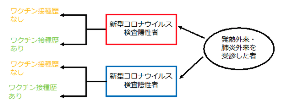
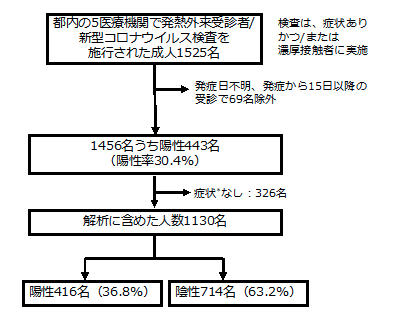

```{r setup, include=FALSE}
packages <- c("readxl","writexl","rvest","gtools","dplyr","openxlsx","readr","magrittr","purrr","lubridate",
              "rlang","scales","zoo","flextable","cowplot","tidyverse","gridExtra","data.table")
lapply(packages, require, character.only = TRUE) 

knitr::opts_chunk$set(echo = FALSE)

options(scipen=2)

##### WRITE ME!!!! #####
dt <- readxl::read_excel("./data/ve_table.xlsx") %>% 
  rename("属性"=1)
Ft_dt <- regulartable(data = dt, col_keys = names(dt),
                         cwidth = 1.4, cheight = 0.20)
```


**端緒**　　　　　　 

新型コロナウイルス感染症のワクチン開発は未曾有のスピードで進み、世界では複数のワクチンが多くの国で承認され、国内においても2021年2月14日にファイザー社製の新型コロナワクチンが製造販売承認となった1。ファイザー社製およびモデルナ社製のmRNAワクチンは大規模なランダム化比較試験で有効性（vaccine efficacy）が90％以上とされ、アストラゼネカ社製のウイルスベクターワクチン1種類も有効性が70％程度とされた2-4。しかし、免疫の減衰や変異株の出現による有効性の低下が指摘されており、国内外において、実社会におけるワクチン有効性（vaccine effectiveness）を経時的に評価していく必要性がある5。そこで、国立感染症研究所では、複数の医療機関の協力のもとで、発熱外来等で新型コロナウイルスの検査を受ける者を対象として、インフルエンザワクチン等の有効性評価で一般的に用いられている症例対照研究（test-negative design）6-7を開始した。本報告では、その6-7月分の暫定結果を報告する。

**方法**　

2021年6月9日から7月31日までに東京都内の5ヶ所の医療機関の発熱外来等を受診した成人を対象に、検査前に基本属性、新型コロナワクチン接種歴などを含むアンケートを実施した。除外基準である未成年者、意識障害のある者、日本語でのアンケートに回答できない者、直ちに治療が必要な者、本アンケート調査に参加したことのある者には調査参加の打診を行わなかった。のちに各医療機関で診断目的に実施している核酸検査（PCR）の検査結果が判明した際に検査陽性者を症例群（ケース）、検査陰性者を対照群（コントロール）と分類した（図1）。発症から14日以内で、37.5℃以上の発熱、全身倦怠感、寒気、関節痛、頭痛、鼻汁、咳嗽、咽頭痛、呼吸困難感、嘔気・下痢・腹痛、嗅覚味覚障害のいずれか1症状のある者に限定して解析を行うこととした。

ワクチン接種歴については、未接種、1回接種のみ、2回接種の3つのカテゴリーに分けた。また接種後の期間を考慮するため、未接種、1回接種後13日目まで、1回接種後14日から2回接種後13日目まで（partially vaccinated）、2回接種後14日以降（fully vaccinated）の4つのカテゴリーに分けた。ロジスティック回帰モデルを用いてオッズ比と95%信頼区間（CI）を算出し、ワクチン有効率は（1-オッズ比）×100％で推定した。多変量解析における調整変数としては、先行研究を参照し、年齢、性別、基礎疾患の有無、医療機関、カレンダー週、濃厚接触歴の有無、過去1ヶ月の新型コロナウイルス検査の有無をモデルに組み込んだ。ワクチン有効率においては、多変量解析から得られた調整オッズ比を使用した。




図１．研究デザイン（症例対照研究（test-negative design））

なお、調査期間中、東京都では6月20日までは緊急事態宣言、6月21日から7月11日まではまん延防止等重点措置、7月12日からは緊急事態宣言が発出されていた。また、民間検査会社における変異株スクリーニングの状況としては、6月初旬の調査開始時にはB.1.1.7系統（アルファ株）が大部分であったが、7月下旬にはB.1.617.2系統（デルタ株）が大部分を占めるという置き換わり期であった8。

本調査は国立感染症研究所および協力医療機関において、ヒトを対象とする医学研究倫理審査で承認され、実施された（国立感染症研究所における審査の受付番号1277）。

**結果**　

都内の5医療機関において、発熱外来等を受診した成人1525名が本調査への協力に同意した。うち、発症日不明および発症から15日以降に受診した69名、症状のなかった326名を除外して解析した（図2）。



図2．フローチャート

解析に含まれた1130名（うち陽性416名（36.8%））の基本特性を表1に示す。年齢中央値（範囲）33（20-83）歳、男性546名（48.3%）、女性584名（51.7%）であり、何らかの基礎疾患を267名（23.6%）で有していた。また、ワクチン接種歴については表2に示しており、未接種者は914名（83.4%）、1回接種した者は141名（12.9%）、2回接種した者は41名（3.7%）であった。なお、ワクチン接種歴のある182名中、回答のなかった9例を除いて63名（36.4%）がワクチン接種記録書等の原本や写真等を携帯しており、110名（63.6%）はカレンダーや手帳を見ながらアンケートを回答した。

表１．研究対象者の基本属性

```{r, echo=FALSE,warning =FALSE, results = "asis", fig.width=12,fig.height=7}

Ft_dt

```

**考察**　

本報告では、ワクチンを接種して14日以上経過した者においては未接種者と比較して、有意に感染のオッズが低く、国内においても現時点で承認されているワクチンの新型コロナウイルス感染症の発症に対する有効性が示された。また、接種回数・（短期的には）接種からの期間が長くなるにつれて有効率が高くなる傾向が見られた。ワクチンを2回接種している者においては高いワクチン有効率を認めたが、人口に占める新型コロナワクチンを2回以上接種している者の割合が小さく、2回接種してから14日後以降に診断された者（いわゆるブレイクスルー感染例）を1名で認めるのみであるため、今後の解析で変動する可能性がある。ただし、諸外国の実社会におけるワクチン有効性評価と概ね一致するものであり5、例えば、英国からの報告では、接種間隔がわが国とは異なるものの、ファイザー社製の新型コロナワクチン（BNT162b2）接種者におけるB.1.1.7系統（アルファ株）に対する有効率は93.7%（95%CI 91.6-95.3%）、B.1.617.2系統（デルタ株）に対する有効率は88.0%（95%CI 85.3-90.1%）であった9。留意すべき点として、ワクチンの有効性は、流行状況、各変異株の割合、感染対策の緩和、ワクチン接種からの期間（免疫減衰の可能性）等の要素が影響している可能性があり、総合的に、経時的に判断すべきである。一方で、本報告では1回接種13日目までは有効性が認められず、これは先行研究と一致する結果であった。これはバイアスの影響が少ないことを示唆する指標の一つとなっている10。なお、諸外国や本報告の通り、新型コロナワクチンの有効性は100％ではない（ブレイクスルー感染が起こりうる）ため、現状の流行状況ではワクチン接種者においても感染対策を継続することが重要である。本調査はあくまでも迅速な情報提供を目的としている暫定的な解析であり、今後もより詳細な解析を適宜行い、変異株や感染対策の緩和の影響、免疫減衰の可能性等をみていくために、経時的に評価していくことが重要である。

**制限**

本調査および報告においては少なくとも以下の制限がある。まず、本報告はあくまでも6-7月分の暫定的な解析結果であり、サンプルサイズが限定的であり、今後の症例数の増加、変異株の影響、流行・対策状況の変化によって結果が変わる可能性がある。特に、点推定値については、今回ブレイクスルー感染例は1名しか認めず、信頼区間も広いため、解釈に注意が必要である。2つ目に、交絡因子、思い出しバイアス、誤分類等の観察研究の通常のバイアスの影響を否定できない。特にワクチン接種歴については、ワクチン接種記録書等の原本や写真を携帯している者は少なく、カレンダーや手帳をみながら回答する者が多かった。3つ目の制限として、欠損値は本解析では除外している。ただ、ワクチン接種歴の欠損を未接種として解析に含めた場合でもオッズ比は同様であった。4つ目の制限として、今回の調査はアンケートに回答可能な軽症例を対象としており、無症状病原体保有者・中等症例・重症例・死亡例における有効性を評価しておらず、ワクチンの種類ごとの有効性は評価していない（モデルナ社製ワクチンの製造販売承認は5月21日であり、ファイザー社製の2月14日より遅かったため陽性者の割合に違いが出ている可能性が高い）。5つ目の制限として、本研究では陽性例についてウイルスゲノム解析を実施していないため、各症例における変異株の割合については不明である。調査期間においては、B.1.1.7系統（アルファ株）からB.1.617.2系統（デルタ株）の置き換わり期であり、B.1.617.2系統（デルタ株）が大部分を占めるようになった際の有効性についても今後検討していく必要がある。最後に、本報告で示したのは短期的な有効性であり、長期的な有効性については今後調査を継続していくのが重要である。

**参考文献**

国立感染症研究所・厚生労働省健康局結核感染症課．新型コロナウイルス感染症（COVID-19）2021年5月現在．病原微生物検出情報（IASR）．2021年7月号．
Polack FP, Thomas SJ, Kitchin N, et al. Safety and Efficacy of the BNT162b2 mRNA Covid-19 Vaccine. N Engl J Med. 2020;383(27):2603-2615. doi:10.1056/NEJMoa2034577
Baden LR, El Sahly HM, Essink B, et al. Efficacy and Safety of the mRNA-1273 SARS-CoV-2 Vaccine. N Engl J Med. 2021;384(5):403-416. doi:10.1056/NEJMoa2035389
Voysey M, Clemens SAC, Madhi SA, et al. Safety and efficacy of the ChAdOx1 nCoV-19 vaccine (AZD1222) against SARS-CoV-2: an interim analysis of four randomised controlled trials in Brazil, South Africa, and the UK. Lancet. 2021;397(10269):99-111. doi:10.1016/S0140-6736(20)32661-1
Johns Hopkins Bloomberg School of Public Health and World Health Organization. Results of COVID-19 Vaccine Effectiveness Studies: An Ongoing Systematic Review. Updated July 22, 2021.
Sullivan SG, Feng S, Cowling BJ. Potential of the test-negative design for measuring influenza vaccine effectiveness: a systematic review. Expert Rev Vaccines. 2014;13(12):1571-1591. doi:10.1586/14760584.2014.966695
国立感染症研究所・厚生労働省健康局結核感染症課．3歳未満小児におけるインフルエンザワクチンの有効性:2018/19シーズン（厚生労働省研究班報告として）．病原微生物検出情報（IASR）．2020年11月号．
厚生労働省．アドバイザリーボード資料．https://www.mhlw.go.jp/content/10900000/000823689.pdf
Lopez Bernal J, Andrews N, Gower C, et al. Effectiveness of Covid-19 Vaccines against the B.1.617.2 (Delta) Variant. N Engl J Med. 2021;385(7):585-594. doi:10.1056/NEJMoa2108891
Tenforde MW, Olson SM, Self WH, et al. Effectiveness of Pfizer-BioNTech and Moderna Vaccines Against COVID-19 Among Hospitalized Adults Aged ≥65 Years - United States, January-March 2021. MMWR Morb Mortal Wkly Rep. 2021;70(18):674-679. doi:10.15585/mmwr.mm7018e1
注意事項
迅速な情報共有を⽬的とした資料であり、内容や⾒解は知見の更新によって変わる可能性がある。


